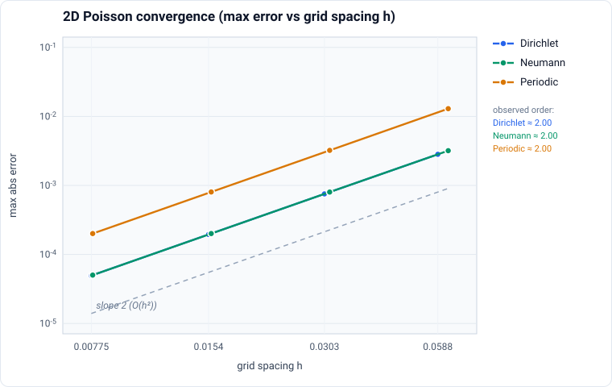

# algo-pde

Fast spectral Poisson and Helmholtz solvers for Go, built on top of `algo-fft`. The library uses plan-based APIs (like FFTW) to precompute eigenvalues and reuse transform plans for many solves on the same grid.

🔊 **Interactive WebAssembly demo** — an [Acoustic Room Modes lab](https://cwbudde.github.io/algo-pde/) runs entirely in the browser: click to place a harmonic source and sweep the drive frequency to watch the rigid room's standing-wave (modal) pressure pattern form. It solves the driven acoustic Helmholtz equation (`(−k² − Δ)p = s`) with a small complex damping shift via the WASM-compiled solver. Source lives in [`demo/`](demo/); build and run locally with `just demo-dev` (see [demo/README.md](demo/README.md)).

## Motivation

- Fast repeated solves on fixed, regular grids without per-solve allocations.
- FFT-based diagonalization handles periodic/Dirichlet/Neumann BCs cleanly.
- Lightweight Go API with explicit control over nullspace handling.

## Features

- O(N log N) solvers for Poisson and Helmholtz on 1D/2D/3D regular grids.
- Boundary conditions per axis: Periodic, Dirichlet, Neumann, and mixed.
- Real-to-real transforms (DST/DCT) implemented via FFT for physical boundaries.
- Nullspace handling options for periodic/Neumann problems.
- Zero-allocation solve path with reusable plans and work buffers.

## Install

```bash
go get github.com/cwbudde/algo-pde
```

## Quick Start

```go
package main

import (
	"log"

	"github.com/cwbudde/algo-pde/poisson"
)

func main() {
	// 2D periodic Poisson solve on a 128x128 grid.
	plan, err := poisson.NewPlan2DPeriodic(128, 128, 1.0/128, 1.0/128)
	if err != nil {
		log.Fatal(err)
	}

	rhs := make([]float64, 128*128)
	sol := make([]float64, 128*128)
	// fill rhs...

	if err := plan.Solve(sol, rhs); err != nil {
		log.Fatal(err)
	}
}
```

## Helmholtz Example

```go
plan, err := poisson.NewHelmholtzPlan(
	2,
	[]int{128, 128},
	[]float64{1.0 / 128, 1.0 / 128},
	[]poisson.BCType{poisson.Dirichlet, poisson.Dirichlet},
	1.5,
)
```

## Screened Poisson / Diffusion Step

The screened Poisson form

```
u - nu * Delta u = f
```

appears in implicit diffusion and reaction-diffusion steady states. Divide by
`nu` to match the Helmholtz form:

```
(1/nu - Delta)u = f/nu
```

For an implicit Euler diffusion step `u^{n+1} - nu*dt*Delta u^{n+1} = u^n`, set
`alpha = 1/(nu*dt)` and `rhs = u^n / (nu*dt)`.

## Package Layout

- `poisson/`: Poisson/Helmholtz solvers, plans, boundary handling.
- `r2r/`: DST/DCT transforms and plans.
- `grid/`: Shape, stride, indexing utilities.
- `fd/`: Finite-difference eigenvalues and validation helpers.
- `examples/`: End-to-end examples (inhomogeneous BCs, diffusion step).

## Usage Notes

- Reuse plans when solving multiple RHS on the same grid.
- Periodic/Neumann problems have a nullspace; configure handling via options such as `WithNullspace` or `WithSubtractMean`.
- Data layout is row-major for 2D/3D, stored in flat `[]float64` slices.

## Demo

A WebAssembly-powered **Acoustic Room Modes** demo is included. [See it live](https://cwbudde.github.io/algo-pde/) or run locally:

```bash
just demo-dev    # Build WASM and start dev server at http://localhost:5173
```

The demo showcases:

- Driven acoustic Helmholtz solve `(−k² − Δ)p = s` at a chosen frequency
- Complex damping shift (`alpha = −k²(1 − iη)`) so resonant modes stay finite
- Neumann boundary conditions (rigid room walls) and their standing-wave modes
- Click-to-place-source and a 40–600 Hz frequency sweep at 256×192 resolution

See [demo/README.md](demo/README.md) for details and [.github/DEPLOYMENT.md](.github/DEPLOYMENT.md) for GitHub Pages setup.

## Development

Common tasks use `just` (or run the Go commands directly):

```bash
just test       # go test ./...
just test-race  # go test -race ./...
just bench      # go test -bench=. -benchmem ./...
just lint       # golangci-lint run
just fmt        # treefmt (gofumpt + gci + prettier)
just wasm       # Build WebAssembly demo module
```

## Performance

- Expected complexity: O(N log N).
- Plans precompute eigenvalues and buffers to avoid per-solve allocations.
- Benchmarks live alongside packages and can be run with `just bench`.
- Use `poisson.WithWorkers(n)` to control solver parallelism (line-wise transforms and eigenvalue division); `n=0` uses `GOMAXPROCS`.
- Scaling improves with larger grids but is typically limited by memory bandwidth and transform setup overhead for small problems.

## Accuracy

The solver is second-order accurate: the discretization error of the 5-/7-point
stencil decreases as O(h²) as the grid is refined, for every boundary condition.
The plot below (`docs/convergence-2d.svg`) shows the max-abs error of a
manufactured 2D solution versus grid spacing on log-log axes; all three BC
families track the dashed slope-2 reference.



Regenerate it (and print the measured per-refinement rates) with:

```bash
go generate ./docs/...
```

The same manufactured-solution studies are asserted, with a strict rate ≥ 1.8
gate, by `poisson/convergence_test.go`.

## Comparison with alternatives

- Iterative sparse solvers (CG/GMRES) are more flexible for irregular domains and variable coefficients, but require preconditioning and more tuning.
- Direct sparse solvers provide robust accuracy but can be much slower and memory-heavy at scale.
- Multigrid is competitive for large problems; this library favors simplicity and throughput on regular grids with FFT-friendly BCs.

## License

[MIT](LICENSE) © 2026 Christian Budde.
